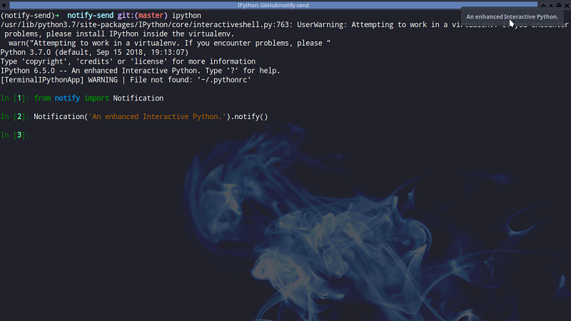

# notify-send



## Installation

```sh
    pip install notify-send
```

## Usage example

```python
    from notify import Notification
    Notification('title', 'body message')
```

## Development setup

```sh
    virtualenv venv
    source venv/bin/activate
    python setup.py develop
```

## Release History

-   0.0.6 - The first proper release
    -   Work in progress

## Meta

André P. Santos – [@ztzandre](https://twitter.com/ztzandre) – andreztz@gmail.com

Distributed under the MIT license. See `LICENSE` for more information.

[https://github.com/andreztz/notify-send](https://github.com/andreztz/)

## Contributing

1. Fork it (<https://github.com/andreztz/notify-send/fork>)
2. Create your feature branch (`git checkout -b feature/fooBar`)
3. Commit your changes (`git commit -am 'Add some fooBar'`)
4. Push to the branch (`git push origin feature/fooBar`)
5. Create a new Pull Request
